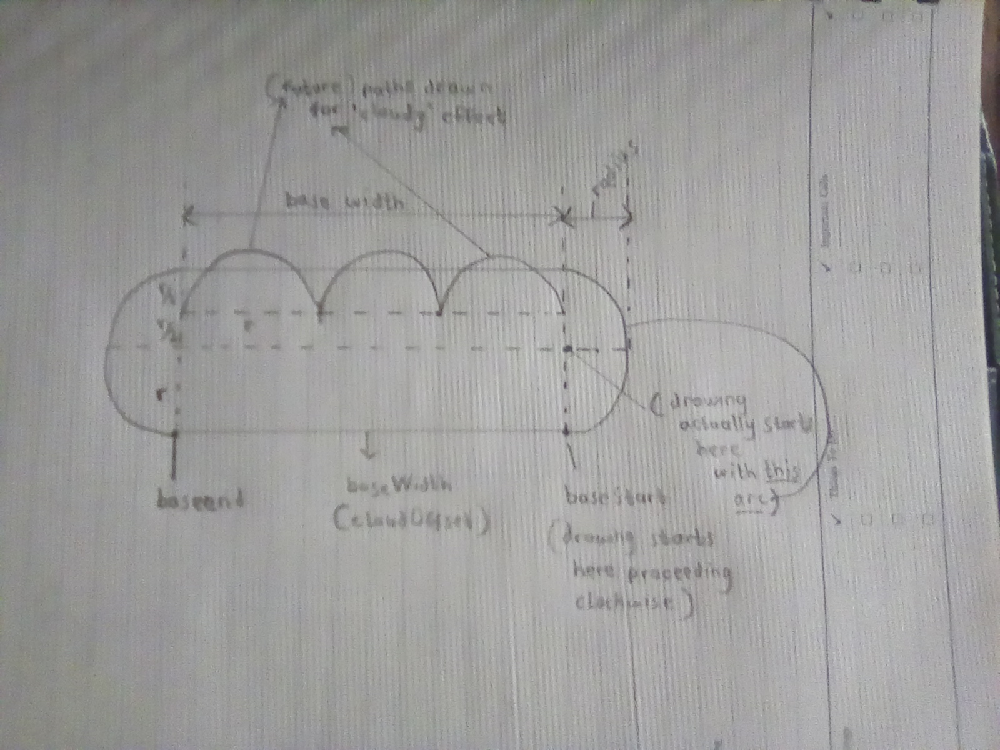
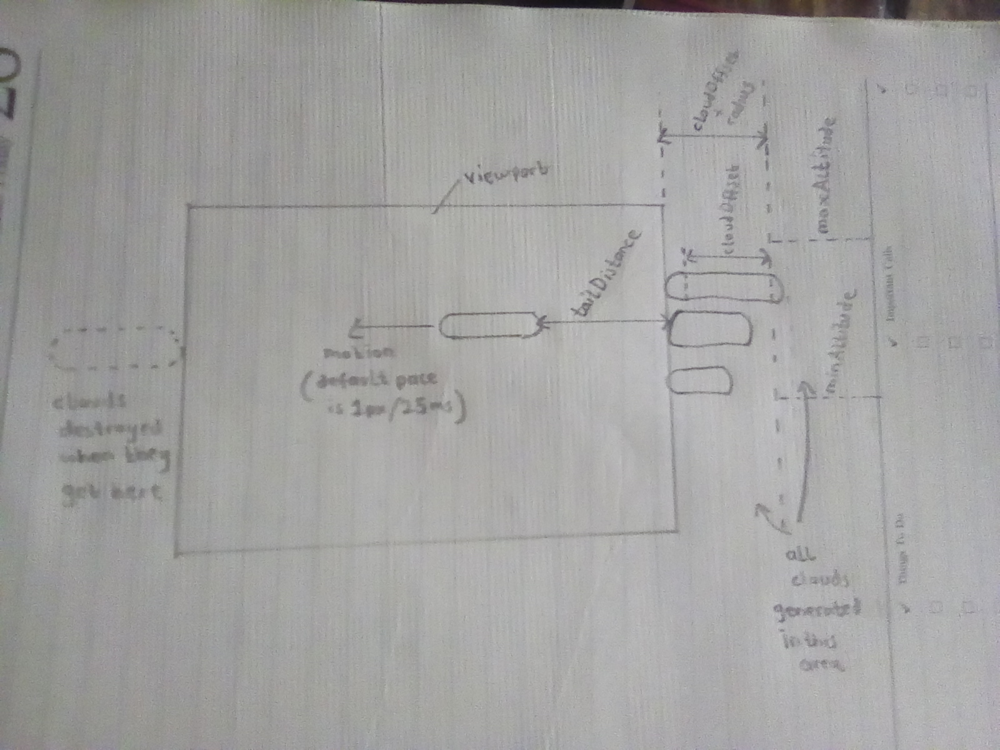
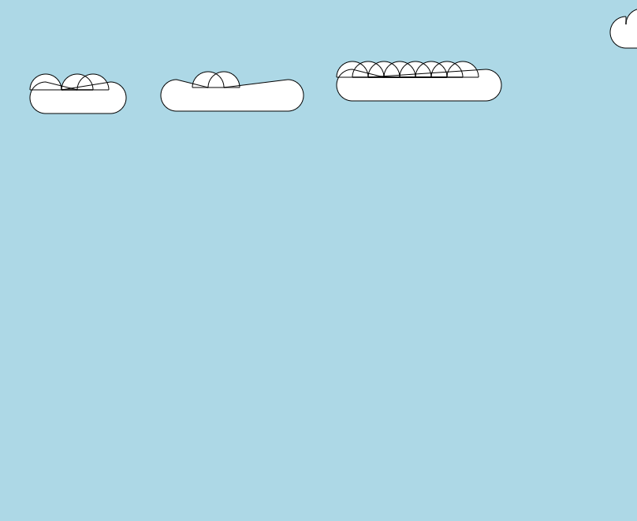
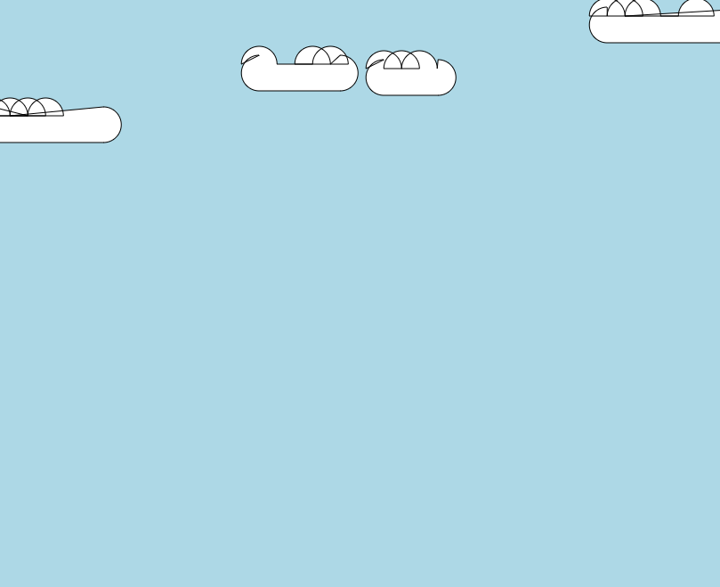
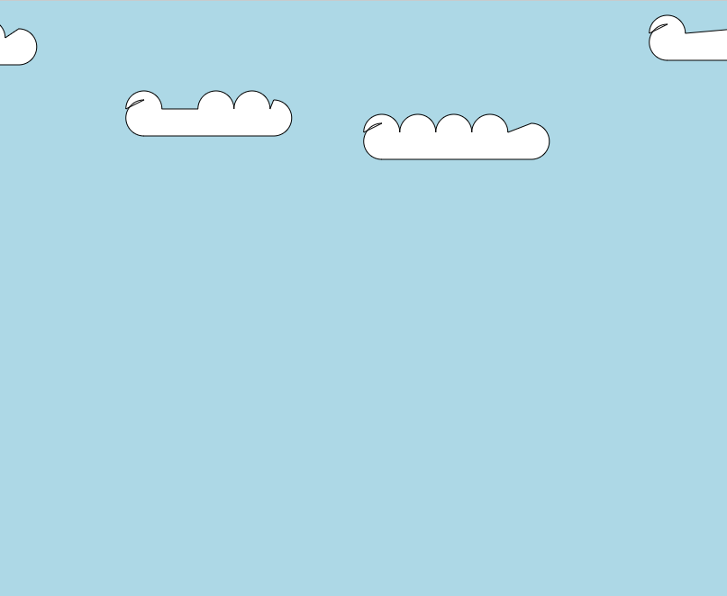
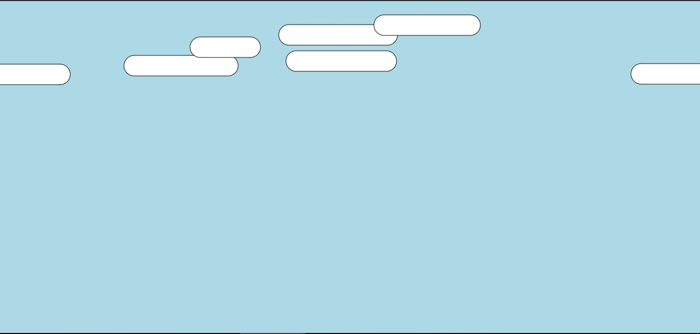

# Live Demo
View on [codepen](https://codepen.io/njuki/pen/KKZKKYL)

# Gallery
## Planning
<pre>planning phase..</pre>

 

## Fails
<pre>some funny fails I got 
as I was working through the drawing algorithm 
(the last one kinda looks like ducks hehe)</pre>

 

 

## First Successes
<pre>finally it worked, these were first few good-looking clouds I got</pre>

